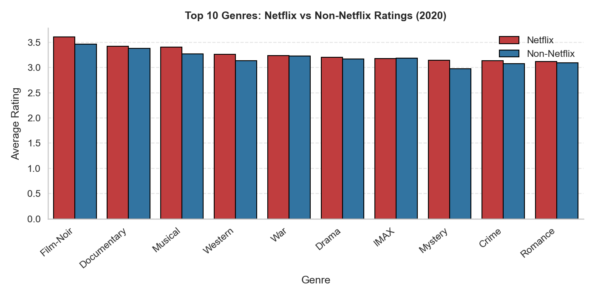

# A better way to find Movies!
## Are you tired of finding movies on your own? Use Netflix's new recommendation algorithm to find your favorite movies and keep watching on the platform.

## Problem Statement  
Netflix uses a recommendation system to provide new content for users to watch. While this is beneficial to customers, as they find content that they like, this is also beneficial to Netflix as users stay engaged on the platform for longer and might recommend it to friends. However, current recommendations are too singular and users feel that they are not being recommended a variety of content. Poor recommendations might give users negative feelings towards Netflix, and might even make them more prone to cancelling their subscription. Additionally, with many new streaming services popping up, there is increased competition for Netflix and an incentive for them to improve their platform (both by range of content available and recommendations). This leads to the current, specific problem: Predicting content that users will and enjoy and that Netflix should add to its platform. This is the specific problem because it addresses the fact that movies need to be recommended to users and to Netflix (to add to the platform), so that users will remain engaged on the platform. 

## Solution Description 
Our solution! A new algorithm for Netflix should satisfy customers concerns that they are not being provided a wide variety of content to watch. Additionally, the new system should provide Netflix with a way to determine what movies they should try to add to their platform. To that end, our algorithm was trained on reviews of movies that are presently on Netflix. Now, with the model trained upon this data, it is prepared to predict if a new user would like (via a higher rating) a specific movie (either on or off Netfilx). It is also able to predict if a specific movie should be added Netflix based on predicted ratings. Overall, this helps Netflix provide and recommend content better and it helps users find movies that they will enjoy on the platform. We are confident that our solution will help users enjoy Netflix more and recommend all of their interesting movies to friends/family! 

## Chart
Below is a chart that shows the average ratings by genre for movies on Netflix versus movies not on Netflix. With our new algorithm we hope to widen the rating gap (between Netflix and non Netflix movies) by providing more tailored and well-liked content to users. Having been provided with bespoke content, users will hopefully leave more higher reviews and recommend Netflix to their friends/family!

